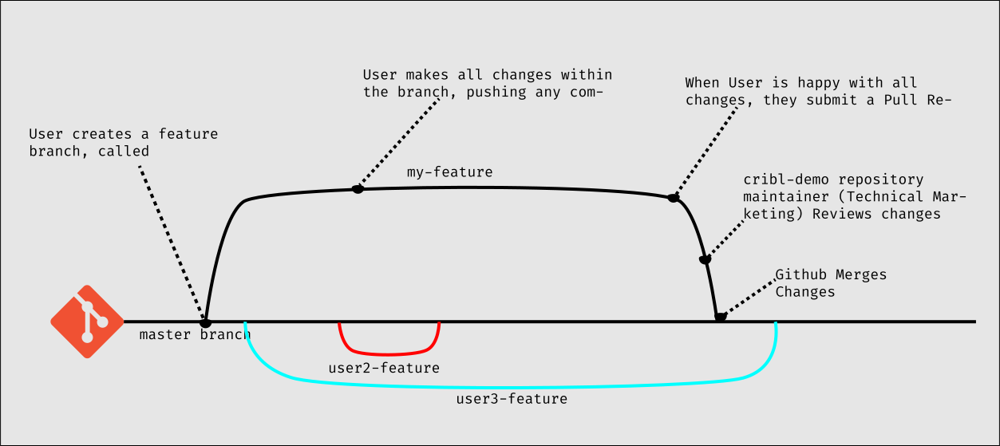

# Contributing to cribl-demo

The demo environments are built this github repo. At the time of this writing, the deployed branch is the k8s branch - This will soon be merged to master. 

## Intro

The cribl-demo repo is managed in Github, with Technical Marketing (Steve at the moment) maintaining the repo. We use a fairly typical feature branching approach to collaborative development. 



## Git Setup

### GitHub Access

The cribl-demo repo is now mastered in github, so in order to contribute, you’ll need a github.com ID - go to [https://github.com/](https://github.com/), click on “sign up”, and create an account. Preferably, use your cribl email address for the account. Once you’ve created your account, associate an SSH key with it. See the [github docs](https://docs.github.com/en/github/authenticating-to-github/adding-a-new-ssh-key-to-your-github-account) for details on doing that.

Once you’ve got an account set up, and an ssh key added to it, send [@Steve Litras](mailto:steve@cribl.io)​ a note to add you to the repository. You’ll be added with write access to the repo.

### Cloning to Local

Once you’ve got an account and an ssh key, you can clone the repo (you just won’t be able to do anything other than read until your account is enabled for the repo). To do this, just run:
```
git clone git@github.com:criblio/cribl-demo.git
```

This will create a “cribl-demo” directory in your current working directory, and copy all of the contents of the repo to it.

### Creating a Feature Branch

Direct writing to the k8s or master branch should not be done. Instead, you should create a branch, based off of the branch you want to eventually merge into. For now, that is k8s, but should shift to master by 2/9. There are a few ways tro create a branch, but the easiest way is to go to the github repo’s page at:

[https://github.com/criblio/cribl-demo](https://github.com/criblio/cribl-demo)

Once there, select the branch you need to base your branch off of in (see the below image).


Click on the branch selector again, and start typing the name of the branch you want to create. If you’ve been enabled for write access, you should see something like this:


Go ahead and select “Create branch”. At this point, you’ve created the branch on the github server. Now, you need to pull it locally. In your local shell, in the cribl-demo directory, type:

```
git fetch && git checkout <new branch name>
```

replacing `<new branch name>` with the name of the branch you just created. The `git fetch` reaches out to the repo for updates (which will include the new branch you just created), and then the `git checkout` pulls down the metadata locally, and switches your local to the newly created branch. Once you’ve done this, any git commands you issue will be operating on that branch.


## Exploring the Repository’s Structure

The directory structure looks something like this:

* [apiserver](apiserver/README.md)
* [cribl](cribl/README.md)
* [demo-cluster](demo-cluster/README.md)
* [gogen](gogen/README.md)
* [grafana](grafana/README.md)
* [influxdb2](influxdb2/README.md)
* [minio](minio/README.md)
* [mutating-webhook](mutating-webhook/README.md)
* [prometheus](prometheus/README.md)
* [redis](redis/README.md)
* [splunk](splunk/README.md)
* [telegraf](telegraf/README.md)

Most of these directories are used to configure the containers in the demo environment. Notable exceptions are:

* demo-cluster - this directory contains the files needed to set up an equivalent EKS cluster to the one we run for the demo environments.

* mutating-webhook - this is the mechanism that deploys appscope to all containers. This is currently working on the local minikube run, and not the EKS deploys (on the backlog).

